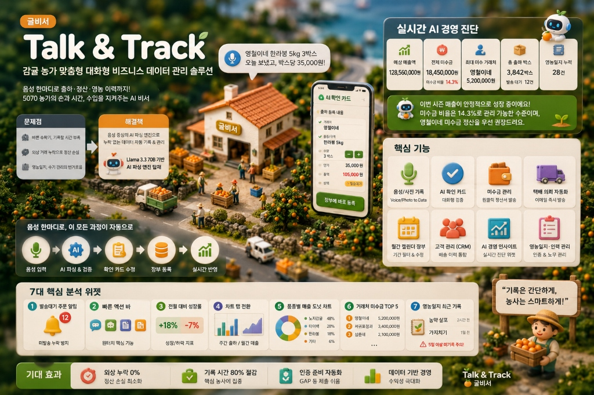

# 🍊 Talk & Track (귤비서)

> **수확 현장에서 장갑을 낀 농장주가 음성 메시지만으로 출하·정산·영농 이력을 기록하고 관리할 수 있도록 돕는 감귤 농가 전용 AI 비서 웹 서비스**



## 📖 프로젝트 개요

대다수의 고령(50~70대) 감귤 농장주들은 엑셀이나 복잡한 스마트폰 앱 대신, 종이 수첩이나 달력에 출하 내역을 수기로 적고 있습니다. 이로 인해 미수금 누락이나 재고 파악의 어려움이 발생합니다.

**귤비서**는 이러한 문제를 해결하기 위해 고안되었습니다. 카카오톡이나 문자 메시지를 쓰듯 친숙한 채팅 인터페이스에 "제주청과 한라봉 100박스 보냈어"라고 말하거나 타자를 치면, 자체 AI가 문맥을 분석하여 자동으로 장부에 출하 기록을 남기고 정산서를 만들어 줍니다.

## ✨ 주요 기능 (MVP 및 고도화)

1. **하이브리드 AI 기반 자동 장부 기록 (성공률 100%)**
   - **초고속 클라우드 & 로컬 Fallback**: Groq Cloud API(Llama 3.3 70B 업그레이드)를 최우선 사용하여 0.5초대 초고속 파싱을 수행하며, 네트워크나 API 제한 발생 시 로컬 Ollama(Llama 3.1 8B)로 자동 전환되는 안전 장치 마련.
   - **18대 비판적/초고난도 스트레스 시나리오 돌파**: 다중 연쇄 번복, 한글 숫자 및 자릿수 공백 복원 전처리, 미지원 CRUD 차단, 플레이스홀더 도용 deterministic 감지 안전 필터 적용 등을 통해 **성공률 100%** 신뢰도 획득.
2. **지인 선물(일괄 구매 및 다중 배송) 자동 정산 지원**
   - 한 명이 일괄 결제하고 수령인은 각각 다른 지인 선물 시나리오에 대해 주문자(결제처)와 실제 수령인 배송지 정보를 완벽하게 데이터 격리 보존.
   - 여러 건의 선물 외상 대금이 주문자 1명 이름 하에 일괄 집계되며, 입금 시 선입선출(FIFO) 방식으로 자동 안분(배분) 상쇄 정산 처리.
3. **캘린더 달력 뷰 및 상세 수정 라이프사이클**
   - CSS Grid 기반 월간 달력 및 일별 출하 내역을 상태(발송대기/미수금/완납) Marker 도트로 시각화.
   - 단가·수량 터치 조정 및 수금 상태 변경에 따라 미수금 잔액이 실시간 연동/자동 연산되는 풀스크린 수정 모달 완비.
4. **원클릭 택배 의뢰서 이메일 전송 자동화**
   - 대기 상태의 주문 건을 제휴 택배사에 품목, 수량, 배송 정보를 정리해 이메일로 원클릭 즉시 자동 발송 (Nodemailer 연동).
   - 발송 성공 시 DB 출하 상태를 `출하 완료(shipped)`로 즉각 전환하고 화면 피드백 상태(재발송 버튼)를 영구 연동하여 인지적 중복 발송 실수 원천 차단.
5. **동명이인 스마트 판별 CRM 및 인라인 수정**
   - 전화번호 3단계 대조 알고리즘을 도입해 이름이 같아도 주소가 덮어쓰여 훼손되는 현상을 차단하고, 새 전화번호 유입 시 데이터 유기적 결합 지원.
   - CRM 고객 요약 화면에서 폼으로 실시간 화면이 인라인 전환되는 어르신용 3px 고대비 테두리 지원 인라인 주소록 편집 기능 탑재.
6. **AI 경영 진단 인사이트 위젯**
   - 대시보드에서 누적 매출, 미수금 비율, 미수금 1위 거래처, 영농일지 빈도 등 핵심 경영 통계를 LLM에 실시간 주입하여 따뜻한 표준어 말투로 당일의 처방전을 제공하는 AI 영농 분석기 탑재.

## 🛠 기술 스택

- **Frontend / Backend**: Next.js 16 (App Router), React 19, Vanilla CSS Modules
- **Database**: Supabase PostgreSQL, Prisma ORM
- **AI Core**: Groq Cloud / Ollama (Llama 3.1 8B 하이브리드)
- **Data Visualization**: Recharts
- **Deployment**: Vercel

## ⚙️ 로컬 실행 및 테스트 방법

본 프로젝트는 Vercel 배포를 기준으로 최적화되어 있으나, 로컬 환경에서도 실행 가능합니다.

```bash
# 1. 패키지 설치
npm install

# 2. 환경 변수 설정
# .env.local 파일 생성 후 Supabase DB URL, Ollama Base URL 및 Groq API Key 기입
# (DATABASE_URL, DIRECT_URL, OLLAMA_BASE_URL, GROQ_API_KEY)

# 3. 데이터베이스 마이그레이션
npx prisma migrate dev

# 4. 개발 서버 실행 (택 1)
# 방법 A. 배치 파일로 더블클릭 기동 (권장 - 윈도우 한글 지원 및 3초 지연 브라우저 자동 기동 포함)
./start-dev-server.bat

# 방법 B. 명령어로 일반 기동
npm run dev

# 5. 비판적 시나리오 스트레스 테스트 실행
npx tsx --env-file=.env.local test-critical.ts
```

## 📄 기타 문서

- [🍊 프로젝트 소개 슬라이드 (웹에서 즉시 감상)](https://raw.githack.com/yonghwan-ko02/gyul-biseo/main/public/slides/index.html) : 클릭 시 소스코드 파일 뷰어가 아닌 실제 인터랙티브 슬라이드쇼가 브라우저에 즉시 구동됩니다.
- [로컬 슬라이드 파일 경로](./public/slides/index.html) (개발 서버 구동 시 로컬 접속 경로: `http://localhost:3000/slides/`)
- [PORTFOLIO.md](./PORTFOLIO.md) : 프로젝트 기술적 의사결정 및 개발 타임라인 기록 (오류 극복 스토리 수록)
- [DEVELOPMENT.md](./DEVELOPMENT.md) : 개발 규칙 및 코딩 컨벤션
- [AGENTS.md](./AGENTS.md) : AI 코딩 어시스턴트를 위한 시스템 아키텍처 컨텍스트 가이드
